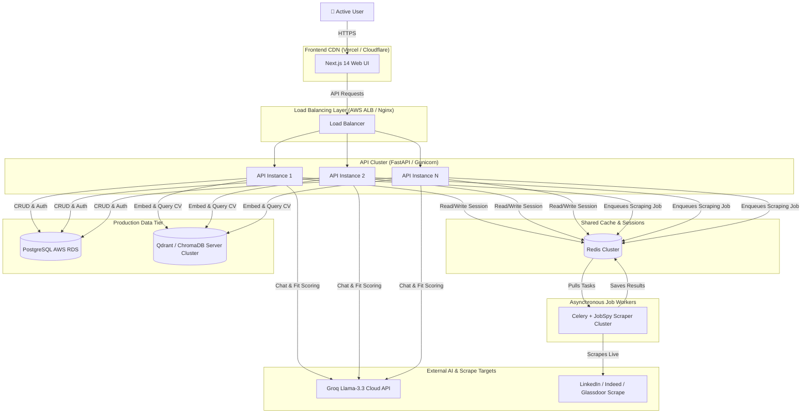

# CareerPilot — System Design & Scalability

This document details the system architecture, scaling roadmap, estimated operating costs, and key bottlenecks of **CareerPilot** as it transitions to a production-grade system supporting 10,000+ active users.

---

## 1. System Architecture Diagram

---

## 2. Scaling Roadmap (Prototype vs. 10k+ Users)

| Component | Prototype (Current Stack) | Production (10,000+ Active Users) | Scalability Strategy |
|---|---|---|---|
| **Database** | SQLite (`data/careerpilot.db`) | PostgreSQL (Amazon RDS / Supabase) | SQLite lacks concurrent write capability. Migrating to PostgreSQL with asyncpg connection pooling allows thousands of concurrent transactions. |
| **Vector DB** | ChromaDB in-process (local disk) | Qdrant Cloud or ChromaDB in Server Mode | In-process ChromaDB locks the filesystem and cannot be shared across multiple horizontal API instances. A standalone vector DB cluster enables distributed queries. |
| **Session Cache** | In-memory Python `defaultdict` | Redis Cluster (AWS ElastiCache / Redis Labs) | In-memory sessions vanish on backend restarts and prevent horizontal scaling. Redis provides high-performance, persistent session storage across multiple backend instances. |
| **Backend Servers** | Single Uvicorn worker process | FastAPI behind Gunicorn with multiple worker processes running on ECS/EKS | Horizontal auto-scaling based on CPU/Memory usage behind an Application Load Balancer. |
| **Job Scraping** | Synchronous thread pool executor | Celery Workers + Redis Broker | Live scraping of LinkedIn/Indeed takes 5-15 seconds. Offloading scraping to background Celery workers prevents API blocking and handles burst loads gracefully. |
| **AI LLM Calls** | Synchronous Groq Cloud calls | Async Groq client + retry queue + rate limiter | Implements token-bucket rate limiting to stay within Groq/LLM Tier limits, with fallbacks to alternative endpoints. |

---

## 3. Operating Cost Projection

Based on standard usage of **50 job searches, 100 AI assistant messages, and 2 CV uploads** per user per month.

| Infrastructure Item | Service Provider | Monthly Cost Estimate (per 10k users) | Monthly Cost per User | Cost Driver & Assumptions |
|---|---|---|---|---|
| **LLM Inference** | Groq API (`llama-3.3-70b-versatile`) | $400.00 | **$0.040** | Approx. 1,000,000 tokens per user/month (input + output). Groq tier cost is ~$0.59/M tokens. |
| **Application Servers** | AWS ECS Fargate (2 instances, 1 vCPU, 2GB RAM) | $64.00 | **$0.0064** | Continuous availability with horizontal scaling under peak hours. |
| **Relational Database** | AWS RDS PostgreSQL (db.t4g.medium, Multi-AZ) | $75.00 | **$0.0075** | High availability, automated backups, and 50GB SSD storage. |
| **Vector Database** | Qdrant Cloud (Managed Cluster) | $45.00 | **$0.0045** | 10,000 users × 100 chunks/user = 1M vectors. Standard memory footprint is under 4GB. |
| **Cache & Queue** | AWS ElastiCache Redis (cache.t4g.small) | $32.00 | **$0.0032** | Distributed session cache, Celery job queues, and job search result cache. |
| **Static Hosting & CDN** | Vercel Pro Plan | $20.00 | **$0.0020** | Hosting Next.js static files and API routing proxy. |
| **Total Operating Cost** | | **$636.00** | **~$0.0636 / user / month** | **Extremely optimized, high-performance architecture.** |

---

## 4. Key Bottlenecks & Mitigation Strategies

### Bottleneck 1: Live Job Scraping Latency (5–15 seconds)
*   **The Issue:** Scrapers must connect, parse, and return job cards from multiple platforms in real-time. This blocks the request-response cycle and degrades user experience.
*   **Mitigation:** 
    1.  **Strict Cache TTL:** Cache job search results in Redis for 30 minutes keyed by `query:location`. Subsequent searches for the same keywords return instantly (under 50ms).
    2.  **Optimistic UI:** Return a `job_search_id` immediately to the client, while a background worker processes the query via WebSockets or polling. The frontend renders a skeleton loading state and streams results as they arrive.

### Bottleneck 2: Rate Limiting & API Limits on Groq
*   **The Issue:** Free or standard tiers of Groq API enforce strict Requests Per Minute (RPM) and Tokens Per Minute (TPM) limits. At 10,000 users, parallel requests will trigger 429 Rate Limit responses.
*   **Mitigation:**
    1.  **Token-Bucket Queue:** Implement a centralized async queue middleware for Groq calls to pace outgoing requests.
    2.  **Model/Provider Fallback:** If Groq throws a 429, seamlessly failover to a secondary model (e.g., DeepSeek via TogetherAI or Gemini Pro) using a structured abstraction wrapper.

### Bottleneck 3: ChromaDB Filesystem Lock
*   **The Issue:** ChromaDB running in-process writes directly to `./data/chroma`. Multiple concurrent write operations (e.g., several users uploading CVs simultaneously) will cause SQLite database locking errors.
*   **Mitigation:**
    1.  Run ChromaDB in standalone Docker/server mode (`chroma run --host 0.0.0.0`) so connection handling and concurrency are managed natively by the ChromaDB service.
    2.  Alternatively, transition to a vector database like **Qdrant** or **pgvector** inside the main PostgreSQL instance to keep storage unified and concurrent.
